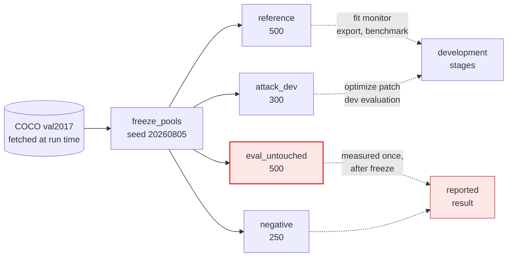
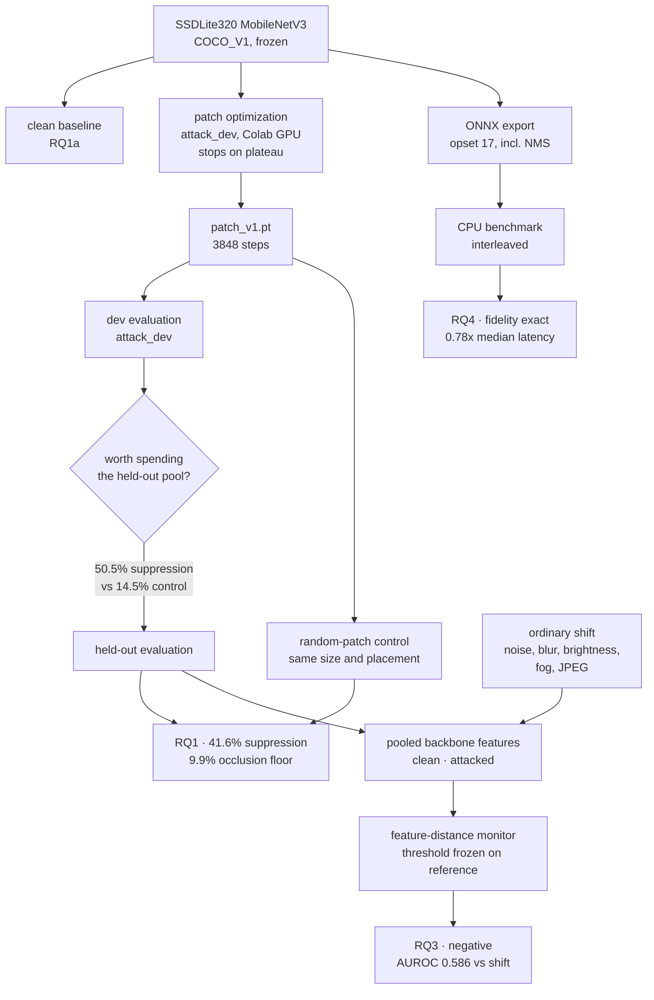

# AdAHuman

A deployment-aware evaluation of adversarial patch attacks against an
edge-oriented person detector.

The question is narrow and empirical: when a person-detection model is attacked
with an optimized patch, and when that same model is converted for a CPU
deployment path, what actually happens to detection performance, to runtime
cost, and to a cheap feature-space diagnostic that might flag the attack?

Nothing here claims to solve adversarial robustness. It measures one attack
against one model under stated conditions and reports the result, including
when the result is negative.

## Status

| Stage | State |
|-------|-------|
| Protocol frozen | done — `configs/protocol_v1.yaml`, pools frozen 2026-08-05 |
| Pools frozen | done — 4 disjoint pools, manifests digested |
| RQ1a clean baseline | done — `results/rq1_clean_baseline.json` |
| RQ1b patch attack | done — `results/rq1_attack.json`, `results/rq1_attack_control.json` |
| RQ3 monitor fit | done — `results/rq3_monitor_fit.json` |
| RQ3 monitor evaluation | done — `results/rq3_monitor_eval.json` (negative result) |
| RQ4 ONNX export and CPU benchmark | done — `results/rq4_export.json`, `results/rq4_benchmark.json` |
| RQ5 reproducibility package | in progress |

Stages 05 and 07 have been exercised end-to-end with an untrained patch on a
24-image subset, so the post-training path is known to run. Those smoke outputs
were deleted; their run logs remain in `logs/` and are marked as smoke tests.

The patch converged: training ran 109 epochs of a 300-epoch cap and stopped on
a plateau, checkpointing epoch 103.

No result is claimed until it appears in `results/` with a dated run log in
`logs/`. See [`LIMITATIONS.md`](LIMITATIONS.md) for what these measurements do
not establish.

## How it fits together

Pool discipline first, because every number below depends on it. Four disjoint
pools are fixed by seed before anything runs, and each stage declares which it
may read. Patch optimization cannot reach the held-out pool even by mistake.



The measurement chain is what makes this deployment-aware rather than a
robustness benchmark. The same frozen model is carried through attack, runtime
monitoring, and format conversion, so the three results are commensurable.



## Clean baseline

`ssdlite320_mobilenet_v3_large`, COCO_V1 weights, person class, score threshold
0.5, IoU 0.5:

| Pool | Images | People | Recall | Precision | AP@[.50:.95] | AP@.50 |
|------|--------|--------|--------|-----------|--------------|--------|
| reference | 500 | 1876 | 0.455 | 0.929 | 0.370 | 0.630 |
| attack_dev | 300 | 1203 | 0.449 | 0.933 | 0.367 | 0.638 |
| eval_untouched | 500 | 1722 | 0.472 | 0.932 | 0.386 | 0.648 |
| negative | 250 | 0 | — | — | — | — |

The negative pool produced 1 false person detection across 250 person-free
images (0.004 per image). Recall near 0.46 reflects the deliberately high 0.5
score threshold on a small 320x320 detector, not a broken baseline; the AP
figures are the threshold-independent view.

The three person-bearing pools agree to within their confidence intervals,
which is the intended check that the random split produced exchangeable pools.

## Attack (RQ1)

Held-out pool, 500 images, 917 patched targets. Every image is scored twice —
clean and patched — so the effect is a paired difference on identical frames.

| | recall on patched targets | suppression rate |
|---|---|---|
| clean | 0.802 | — |
| **trained patch** | 0.477 | **41.6%** [38.1–45.2] |
| random patch (control) | 0.755 | 9.9% [8.0–12.3] |

AP@.50 falls from 0.648 to 0.432. Suppression rate is the paired quantity: of
targets the detector found when clean, the fraction lost under attack. It cannot
be inflated by targets that were being missed anyway.

The random-patch control is what makes the number interpretable. A patch of
identical size and placement, never optimized, still suppresses 9.9% purely by
covering the target. The trained patch is roughly 32 points above that floor,
with non-overlapping intervals.

Two controls support the claim that this is *localized* suppression rather than
a degraded detector: recall on unpatched targets in the same frames moved
−0.005, and false person detections on the 250 person-free images were unchanged
at 0.004 per image.

## Runtime monitor (RQ3) — negative result

The feature-distance monitor does not work, and that is the finding.

| comparison | AUROC |
|---|---|
| clean vs adversarial | 0.639 |
| ordinary shift vs adversarial | 0.586 |
| clean vs ordinary shift | 0.562 |

At the frozen threshold it flags 10.8% of attacked inputs while false-alarming
on 5.2% of clean ones. Against motion blur specifically the AUROC is 0.498 —
indistinguishable from chance.

The second row is the one that matters. A monitor that separates adversarial
from clean but not from fog, blur, and codec noise is a novelty detector, not an
attack detector; in deployment it would alarm on weather and be switched off.
Here it does neither well.

The reported verdict is produced by a function written before the numbers
existed, so the conclusion follows from thresholds fixed in advance rather than
from prose composed afterwards. See [`LIMITATIONS.md`](LIMITATIONS.md) for what
this does and does not generalize to — in particular, the monitor is image-level
and the attacker is non-adaptive.

## Deployment comparison (RQ4)

The full detector, including non-maximum suppression, exports to ONNX opset 17
at 320x320, batch size 1. Conversion fidelity is effectively exact: across 50
reference images, **zero** disagreements in person-detection count at the 0.5
operating threshold, maximum box deviation 9.2e-05 px, maximum score deviation
1.9e-06.

Latency on an Intel i5-8257U at 4 threads, PyTorch and onnxruntime interleaved
over 200 iterations each:

| | PyTorch | onnxruntime | ratio |
|---|---|---|---|
| median | 69.3 ms | 86.8 ms | 0.80x |
| p95 | 75.1 ms | 108.4 ms | 0.69x |
| p99 | 76.2 ms | 114.6 ms | 0.66x |
| min | 57.5 ms | 37.7 ms | 1.53x |
| throughput | 14.4 fps | 11.5 fps | 0.80x |
| load memory | 19.2 MiB | 31.3 MiB | |
| model size | 13.25 MB | 13.46 MB | |

**ONNX Runtime is slower here, not faster** — about 20% at the median, with a
noticeably wider spread. That runs against the common assumption that exporting
to ONNX buys throughput. It is reported as measured.

The two paths were timed *interleaved* rather than one after the other. Running
one path to completion before the other confounds the execution path with CPU
thermal state and background load; a sequential run produced the same median
ratio but much dirtier tails (PyTorch p99 109 ms against 76 ms interleaved).

Two independent runs, a day apart, gave median ratios of 0.78x and 0.80x. The
absolute figures move by a millisecond or two between runs, as timings on a
shared laptop do; the ordering and its rough magnitude are stable.

This is a single machine at a single thread count. See
[`LIMITATIONS.md`](LIMITATIONS.md) — the relative ordering can invert elsewhere.

## Relevance to deployment-aware AI assurance

This artifact demonstrates the core methodological challenge addressed by the
proposed endeavor: evaluating whether security properties measured during model
development remain meaningful after models transition into deployment
environments. It intentionally studies the interaction between adversarial
perturbations, runtime monitoring, and deployment-format conversion rather than
treating robustness as an isolated model-development property.

The three results are only interesting together, and the negative one carries
most of the weight.

**A defense that looks plausible in isolation fails against ordinary operating
conditions.** The feature-distance monitor separates adversarial from clean
inputs at AUROC 0.639 — weak, but not nothing, and enough to look promising if
clean data were the only comparison drawn. Against the benign variation a camera
actually encounters it collapses: 0.586 overall, and 0.498 against motion blur,
which is chance. Evaluated the way such diagnostics often are, against pristine
inputs, this monitor would have been reported as marginally useful. Evaluated
against fog, blur and codec artefacts, it is not usable at all. The difference
is not the method; it is which comparison the evaluation makes.

**Deployment-format conversion has costs invisible to model-level evaluation.**
Conversion fidelity is effectively exact — zero detection-count disagreements,
maximum score deviation 1.9e-06 — so a purely numerical check would report the
converted model as equivalent and stop there. It is nonetheless 20% slower at
the median with materially worse tail latency, which is the property that
determines whether a perception pipeline holds its frame budget. Equivalence and
operational viability are different questions, and only one of them is answered
by comparing outputs.

**Attack strength is not a single number.** The patch suppresses 41.6% of
held-out targets, but a random patch of identical size and placement suppresses
9.9% by occlusion alone. Reported without that control the attack would appear
roughly a quarter stronger than it is. The same holds for the development-to-
held-out gap, 50.5% against 41.6%, which is visible only because the pools were
separated before the patch was optimized.

None of this establishes that these particular findings generalize. One model
family, one attack objective, digital rather than physical patches, a
non-adaptive adversary, and a single CPU. What it does establish is that the
questions are separable and measurable: each of the three results would have
been reported differently, and more favourably, under an evaluation that stopped
at the model boundary. That gap between what is measured in development and what
holds in deployment is the object of study, and reproducible measurement of it
is the contribution this artifact is intended to demonstrate.

See [`LIMITATIONS.md`](LIMITATIONS.md) for the full statement of what these
measurements do not support.

## Design

Three properties are enforced by code rather than by care:

**Pool entitlement.** Each pipeline stage declares which pools it may read.
`PoolDataset` refuses to construct against any other, so patch optimization
cannot see the held-out set even by mistake.

**Protocol freezing.** Environment-dependent protocol fields start as `PENDING`
and are filled by probe scripts. A stage that reads the held-out pool cannot
load the protocol while any field in the sections governing its result is still
`PENDING`.

**Provenance.** Every stage writes a JSON run record: timestamp, git commit and
dirty flag, library and hardware versions, pools read, and the sha256 of every
input and output. Results are traceable to the code that produced them.

These are not decoration. The held-out-pool check caught a real error during
construction: the RQ3 monitor's threshold was being calibrated on the same
images it was fit from, reporting a 5% false-positive rate while the true
held-out rate was 60%. See [`LIMITATIONS.md`](LIMITATIONS.md).

## Reproducing

```bash
brew install python@3.11
python3.11 -m venv .venv && .venv/bin/pip install -r requirements.txt
bash scripts/00_fetch_coco.sh                 # ~1.8 GB

.venv/bin/python scripts/01_probe_model.py --write    # resolve env-dependent fields
.venv/bin/python scripts/02_freeze_pools.py --write   # fix pool membership
.venv/bin/python scripts/03_clean_baseline.py         # RQ1a
```

Patch optimization needs a GPU and runs on Colab:

```bash
bash scripts/make_colab_bundle.sh    # then open notebooks/colab_train_patch.ipynb
```

Bring `artifacts/patch_v1.pt` back before running the evaluation stages. The
patch crosses that boundary as a plain tensor with a recorded digest, so the
training device does not enter any locally measured number.

## Layout

```
adahuman/
  config.py          protocol loading, stage entitlements, freeze enforcement
  data/pools.py      deterministic pool selection and digested manifests
  data/dataset.py    manifest-backed COCO loading
  models/detector.py the frozen detector and its feature tap
  attack/patch.py    EOT patch, differentiable placement, suppression loss
  eval/detection.py  COCO mAP and operating-point metrics
  utils/             hashing, seeding, run records
configs/             protocol and frozen pool manifests
scripts/             numbered pipeline stages
results/  logs/      measurements and their provenance
```

## Provenance and licence

All code is independently written for this project from public literature and
public documentation. No employer or client source code, data, thresholds,
learned parameters, or internal implementation details are used. Model weights
and images are public and downloaded at run time rather than redistributed.

Original code is released under the Apache License 2.0 — see
[`LICENSE`](LICENSE). That covers `adahuman/`, `scripts/`, `configs/`,
`notebooks/`, and the documentation, and nothing else.

Third-party libraries, the pretrained detector weights, and the COCO dataset
remain under their own terms and are not redistributed here; each is fetched at
run time from its own distributor. [`NOTICE`](NOTICE) lists them with their
licenses, and records why the attack code is published in full rather than
limited or withheld.
